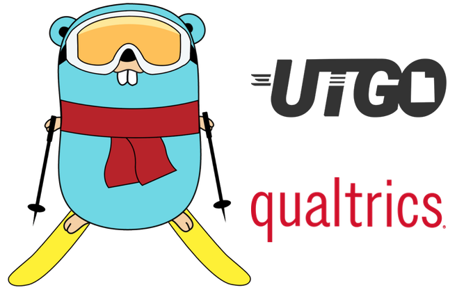

# Lessons From Adopting Go at Qualtrics

Back in September 2017, I teamed up with a coworker to give a presentation for the [Utah Golang User Group](http://utahgolang.com/). We chose to share the lessons we had learned as we adopted Go as a primary programming language at Qualtrics. Our intended audience was companies and developers who were interested in trying out Go and scaling its use within an organization. Many companies are considering Go as its popularity has only continued to rise (for good reason), so I'm excited to repost this content via my blog.

## Summary of the content

Here is a summary of the content of our presentation which will serve as a teaser of the dsfull slides and video below:

### `context.Context` Day in the life of a Qualtrics engineer

### `reflect.Value` How/why Go works for us

### `func main()` Getting the initial buy off

### `go build && ./scale` Process of driving Go adoption among engineers

### `if err != nil` Things we wish we knew / things we’d do differently

### `wg.Wait()` Ideas for future work

## Presentation slides and recording

[Here](https://docs.google.com/presentation/d/18JiufQTTm8GxFRb2uyg2C8RHmm5NbtWU9Se7vBtwkUY/edit?usp=sharing) are the slides we created for the presentation. We retroactively fleshed out the notes section to help the slides stand alone without the presentation. If you prefer the original video, however, the user group recorded our presentation and put together [this Youtube video](https://www.youtube.com/watch?v=8wmEL0JwHQA&feature=youtu.be).

<iframe width="560" height="315" src="https://www.youtube.com/embed/8wmEL0JwHQA" frameborder="0" allow="autoplay; encrypted-media" allowfullscreen></iframe>

# Notes (supplementary to blog post)

