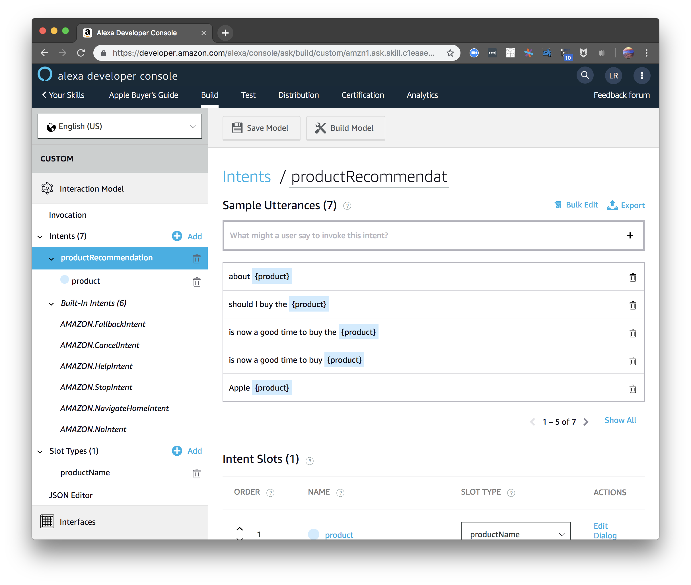
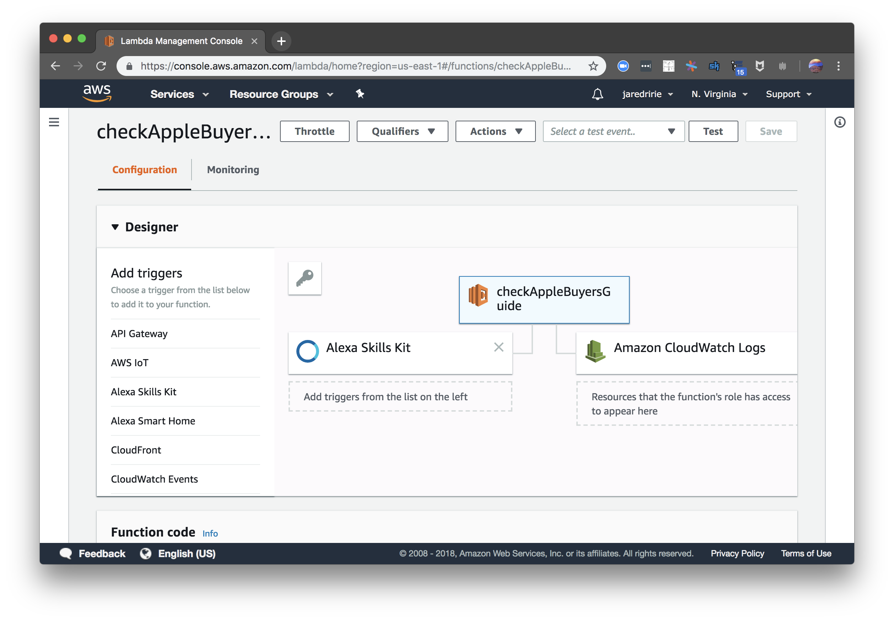
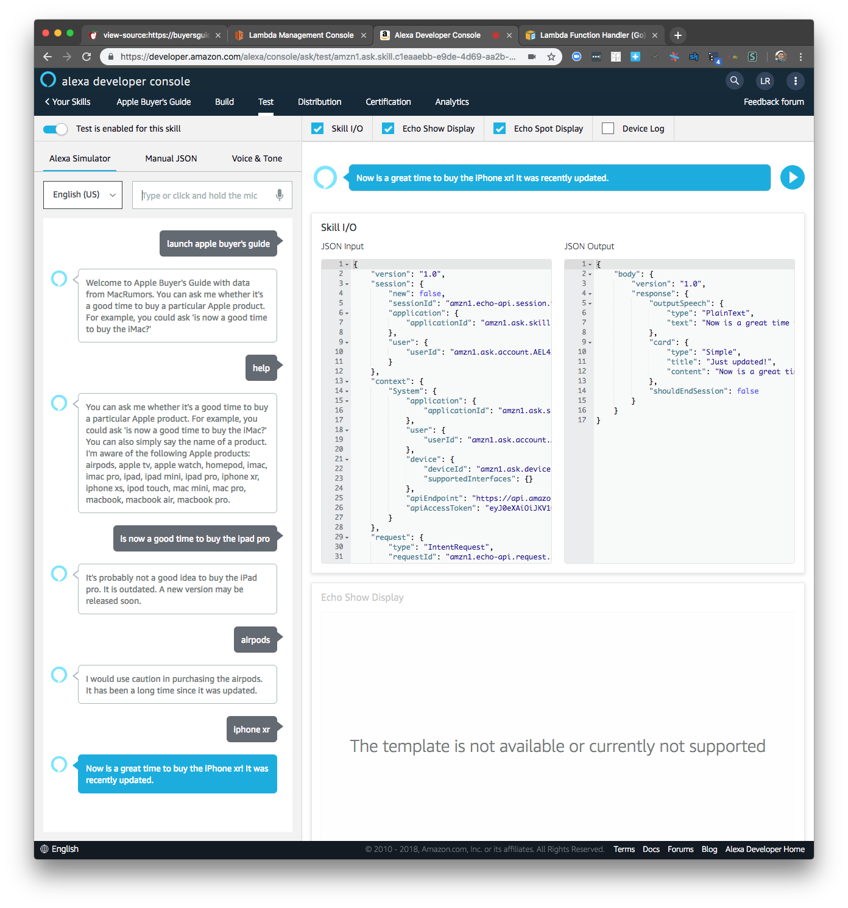
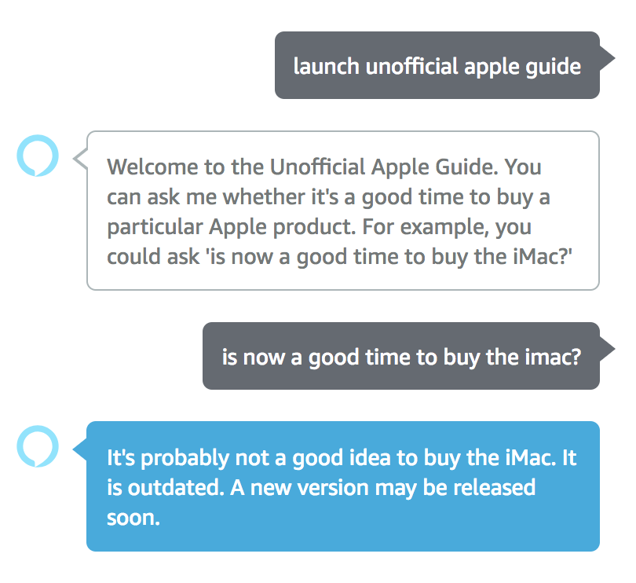
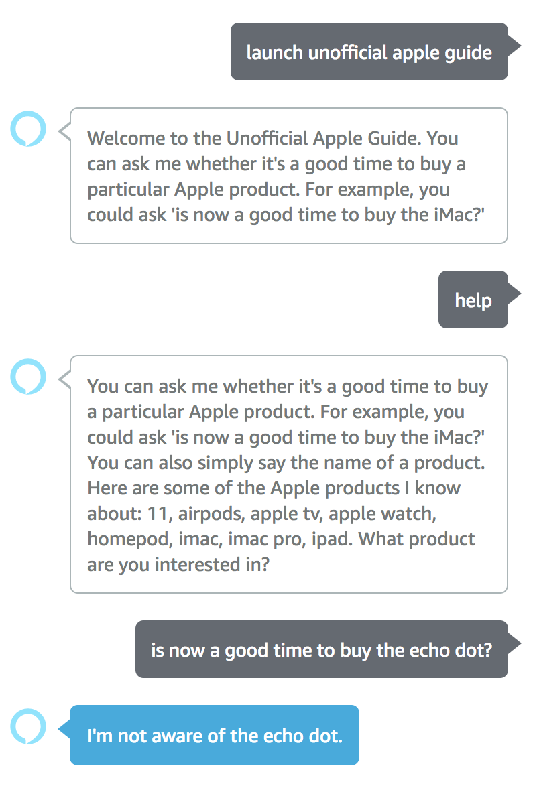
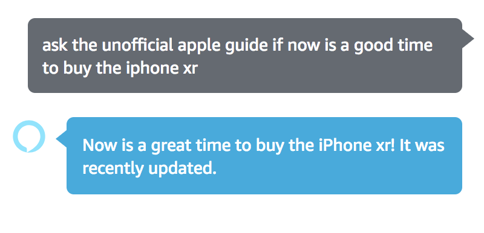
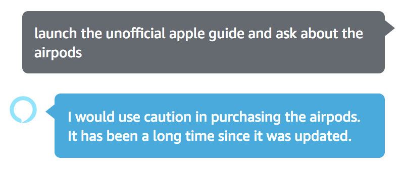

# Amazon Alexa Skill using a Go AWS Lambda Function


Amazon is currently [running a promotion](https://www.digitaltrends.com/home/amazon-alexa-skill-promotion-for-free-dot/) in which developers who publish a new skill to the Alexa Skills Store receive the new Echo Dot. While I do not own any Amazon devices, I decided to participate to get an interesting product, learn more about developing voice-based applications, and write my first AWS Lambda function in Go.

Before I dive into the implementation, I think Amazon deserves some praise for this promotion. It's a win-win that more companies could learn from. Getting to the point of publishing a skill requires participants to go through the entire development process:

* Set up an Amazon Developer and Amazon Web Services accounts
* Learn Alexa terminology like invocations and intents
* Configure the skill in the Alexa Developer Console
* Write an AWS Lambda function that understands how to parse Alexa's requests and generate valid responses
* Submit the skill for review (with a customer-ready description and icon)

With a little incentive, Amazon surely received an impressive number of novel skills submitted to their store because of this promotion, making their product better and more comprehensive. Amazon is also managing to get at least a few hours of work for the cost it takes them to make an Echo Dot. Meanwhile, developers get an interesting side project, diverse development experience, and a consumer product that can run the skills they write. Very cool!

## Alexa skill: Apple Guide

The simple skill I wrote for the purpose of the promotion is called **Apple Guide (Unofficial)**. It offers a convenient way to check whether it's a good time to buy a new Apple product. Through a real-time look at the [MacRumors Buyer's Guide](https://buyersguide.macrumors.com/), this skill allows Alexa to tell you which of four states an Apple product is in: {updated, neutral, caution, and outdated}. A product in the _caution_ state, for example, has not been updated for quite some time, so it may be wise to be patient and wait for a new update. The status _updated_, on the other hand, means that the Apple product was just updated and you're safe to go ahead with the purchase.

To create my skill, I followed two tutorials. The first, ["How To Build A Custom Amazon Alexa Skill, Step-By-Step: My Favorite Chess Player"](https://medium.com/crowdbotics/how-to-build-a-custom-amazon-alexa-skill-step-by-step-my-favorite-chess-player-dcc0edae53fb), shows you how how to create a skill from beginning to end. I highly recommend following this kind of tutorial to get a skill working as it's crucial to have a high-level overview to know what all the steps you'll need to take, what configuration is possible, etc.

The first tutorial gives a great high-level overview, but the AWS Lambda function is written in Python and is not explained in much detail. As I wanted to write my Lambda function in Go, I supplemented with this second tutorial, ["Alexa Skills with Go"](https://medium.com/@amalec/alexa-skills-with-go-54db0c21e758) which covers the following topics:

* Automating deployment of Go-based AWS Lambda functions
* Handling a variety of Alexa Skill request attributes
* Creating and returning Alexa Skill responses
* Deploying code to AWS Lambda without manually zipping the binary created by Go

## Configuring the Alexa skill interface

An Alexa skill is not entirely written in code. Configuration, tests, and distribution are done in the [Alexa Developer Console](https://developer.amazon.com/alexa/console/ask). The console is where you create the **skill interface** whereas the code is where you create the **skill service**:

> The Alexa skill consists of two main components: the skill interface and the skill service.
>
> The skill interface processes the user’s speech requests and then maps them to intents within the interaction model.
>
> The skill service determines what actions to take in response to the JSON encoded event received from the skill interface. Upon reaching a decision the skill service returns a JSON encoded response to the skill interface for further processing. After processing, the speech response is sent back to the user through the Echo.[^1]

### Invocation

The invocation name is the phrase users speak to trigger a particular skill. Keeping it simple and understandable by Alexa is critical--a skill that's hard to launch will never be used.

My initial invocation name was "Apple Buyer's Guide" and turned out to have two major problems. First, it refers to the brand Apple too directly, implying this was an official skill or sponsored by Apple. Second, "Buyer's" proved difficult for Alexa to understand which led to a frustrating experience interacting with the skill. "Unoffical Apple Guide" resolved both of these problems.

I'm not particularly fond of having "unofficial" in the title and invocation name, but Amazon's brand policy proved to be very strict. I ventured "Picking Apples" though that was also rejected.

[Here](https://developer.amazon.com/docs/custom-skills/understanding-how-users-invoke-custom-skills.html) is Amazon's documentation on invocation.

### Intents



Intents capture what the user _intends_ to do, such as ask for help, interact with the skill, or exit the skill. Amazon takes care of the defaults (help, cancel, etc.) but requires configuration for the unique aspects of your skill.

In my case, I needed to define an intent to ask for a product recommendation. Each intent has at least one utterance (word or phrase) the user speaks to invoke the intent. My utterances included:

* should I buy the {product}
* is now a good time to buy the {product}
* Apple {product}

Where `{product}` is a defined slot for the part of the phrase that is variable. In the skill service, I extract the contents of this slot to know which product the user is asking about:

```go
product := request.Body.Intent.Slots["product"].Value
```

### Endpoint

The endpoint is where you define the web location of the skill service. There are two options: an AWS Lambda function or an HTTPS service. I chose to write a Lambda function.

## Writing the AWS Lambda Function (the skill service)

### AWS Lambda



AWS Lambda is part of the [serverless computing movement](https://en.wikipedia.org/wiki/Serverless_computing) which abstracts things like server management and allocation away from developers of event handling code. Rather than standing up a server and running an always-listening web application, you simply write some code (the "lambda function") which runs in response to an event. The code ends up running on some AWS server, just not a server that you manage directly.

Implementing a Lambda function in Go is straightforward. Write a main function that calls `lambda.Start(handler)` where `handler` is the name of a function that matches one of [several signatures](https://github.com/aws/aws-lambda-go/blob/master/lambda/entry.go#L27-L35).

```go
func main() {
    // ...
    lambda.Start(handler)
}
```

In my case, the handler accepts an Alexa request and returns an Alexa response.

```go
func handler(request alexa.Request) (alexa.Response, error) {...}
```

Once you've written your handler, you simply compile a Linux binary, zip it, and upload it to the Lambda Management Console. Set the Runtime to `Go 1.x` and Handler to the name of the binary in the zip file. I wrote a quick bash script to automate creating and zipping the binary:

```bash
set -x

rm -rf alexa-apple-guide.zip
GOOS=linux go build -o alexa-apple-guide -a -ldflags "-w -s -extldflags \"-static\"" -installsuffix cgo
zip -r alexa-apple-guide.zip alexa-apple-guide
```

The article I mentioned earlier, ["Alexa Skills with Go"](https://medium.com/@amalec/alexa-skills-with-go-54db0c21e758), takes this further by automating the step to upload the zip file to AWS.

### Lambda handler

My handler inspects the Alexa request type and responds accordingly. The request could either be launching the skill, providing some intent, or closing the session.

```go
func handler(request alexa.Request) (alexa.Response, error) {
    var response alexa.Response

    switch request.Body.Type {
    case alexa.LaunchRequestType:
        response = alexa.NewResponse(
            "Apple Guide (Unofficial)",
            "Welcome to the Unofficial Apple Guide. You can ask me whether it's a good time to buy a particular Apple product. For example, you could ask 'is now a good time to buy the iMac?'",
            false,
        )
    case alexa.IntentRequestType:
        response = dispatchIntents(request)
    case alexa.SessionEndedRequestType:
    }

    return response, nil
}
```

If it's an intent request, I need to inspect the body to know what the user is intending to do, such as ask for help (`alexa.HelpIntent`) or ask for a product recommendation (`"productRecommendation`).

```go
func dispatchIntents(request alexa.Request) alexa.Response {
    var response alexa.Response

    switch request.Body.Intent.Name {
    case "productRecommendation":
        response = handleRecommendation(request)
    case alexa.HelpIntent:
        response = handleHelp()
    case alexa.CancelIntent, alexa.NoIntent, alexa.StopIntent:
        response = handleStop()
    case alexa.FallbackIntent:
        response = handleFallback()
    }

    return response
}
```

Providing product recommendations is the core of my Alexa skill. First, I extract the product name from the "product" intent slot. With that value, I can look up the status of that product by scraping [MacRumors Buyers Guide](https://buyersguide.macrumors.com/). Given the status, I can construct an Alexa response with my recommendation.

```go
func handleRecommendation(request alexa.Request) alexa.Response {
    product := request.Body.Intent.Slots["product"].Value

    // get status of product ...

    switch status {
    case scraper.Status.Updated:
        return alexa.NewResponse(
            "Just updated!",
            fmt.Sprintf("Now is a great time to buy the %s! It was recently updated.", product),
            true,
        )

    case scraper.Status.Neutral:
       // ...
    case scraper.Status.Caution:
        // ...
    case scraper.Status.Outdated:
        // ...
    case scraper.Status.Unknown:
    }

    return unknownProductResponse
}
```

You can find the complete implementation in [this GitHub repo](https://github.com/jaredririe/alexa-apple-guide).

## Demonstration



Testing in the Alexa Developer Console is convenient. It simulates the experience of using a device with Alexa. Messages to Alexa can be spoken or typed. The following is a standard interaction where the user launches the skill, hears some instruction, and asks a question:



The user can also ask for help:



Once a user is more familiar with a skill, it's useful to combine launching a skill and asking a question:



The exact language used is not critical. Alexa distills what you say down to the invocation name and intent. For example, I can alter the above statement and still trigger the skill correctly:



[^1]: https://medium.com/crowdbotics/how-to-build-a-custom-amazon-alexa-skill-step-by-step-my-favorite-chess-player-dcc0edae53fb

---

# Notes (supplementary to blog post)

https://medium.com/crowdbotics/how-to-build-a-custom-amazon-alexa-skill-step-by-step-my-favorite-chess-player-dcc0edae53fb

* Create a simple Amazon Alexa Skill step-by-step

https://medium.com/@amalec/alexa-skills-with-go-54db0c21e758

* Automate deployment of Go-based AWS Lambdas
* Create and return Alexa Skill Responses
* Handle a variety of Alexa Skill Request attributes (Locale and Attributes)

https://docs.aws.amazon.com/lambda/latest/dg/go-programming-model-handler-types.html

> A Lambda function written in Go is authored as a Go executable. In your Lambda function code, you need to include the github.com/aws/aws-lambda-go/lambda package, which implements the Lambda programming model for Go. In addition, you need to implement handler function code and a main() function.
