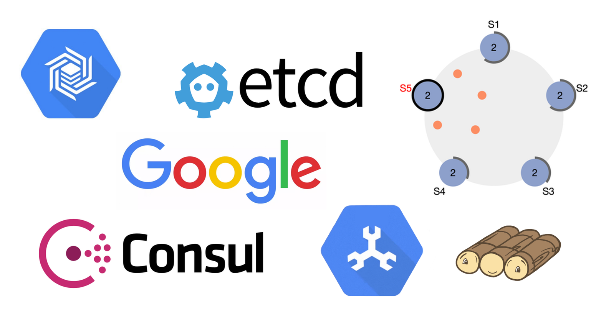
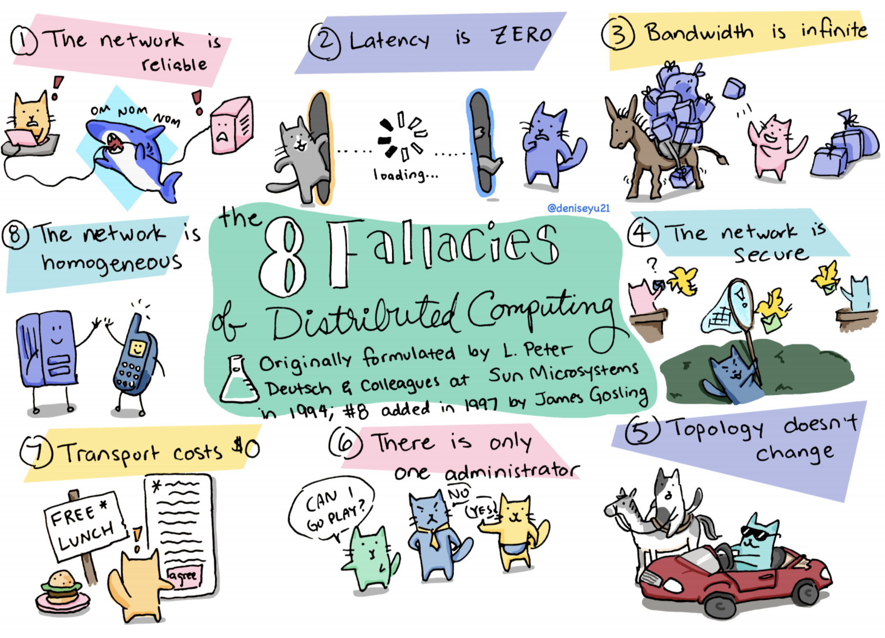
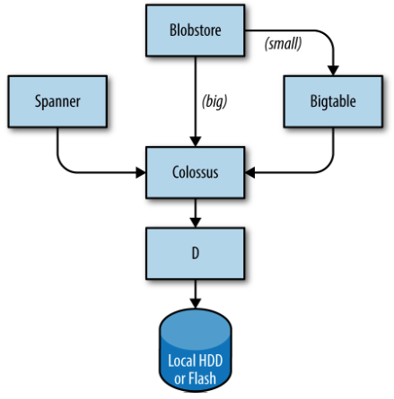
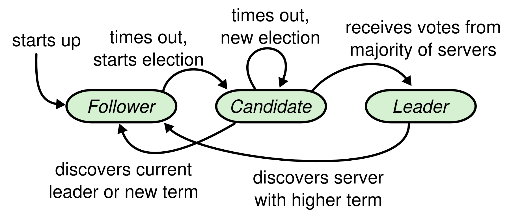
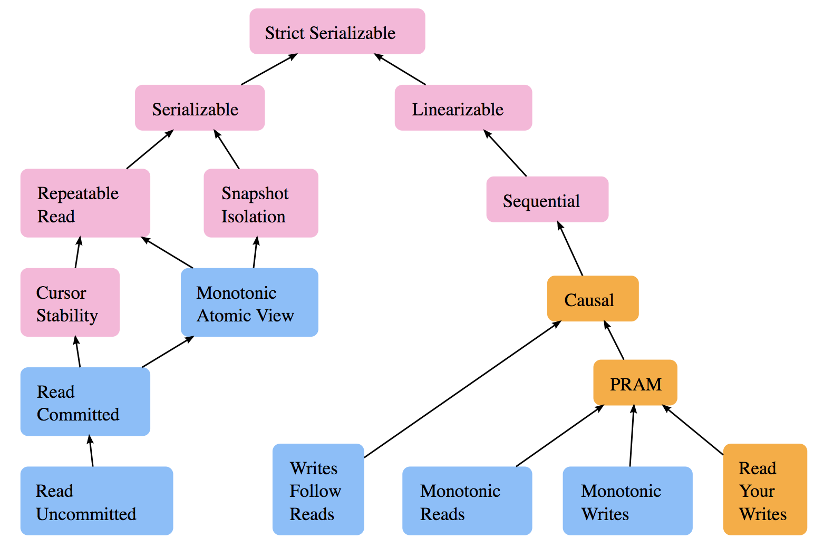

# Introduction to Distributed Systems Course

In my [previous blog post](https://backendology.com/2018/09/10/distributed-systems-course-reading-list/), I created a detailed reading list of the distributed systems content I deemed most important and interesting. This post is the next step towards designing a comprehensive course in distributed systems: creating an introductory course.

Why not simply start at the top of the reading list and work down? I think any good introduction to this topic should provide a sampling of the various concepts and encourage experimentation and hands on learning. I also organized my reading list such that the "Distributed systems in the wild" section is one of the later sections, but I believe that failing to cover some real systems in an introductory course is a lost opportunity. Students and practitioners often have experience interacting with the user-facing parts of systems like Kafka, Memcache, or Cassandra. Some have a basic understanding of proprietary systems at Google like BigTable or Spanner. Satisfying the curiosity to learn how these systems work under the hood can fuel the harder parts of learning distributed systems, such as grappling with Paxos.

Speaking of Paxos, it was designed first but the newcomer Raft is intended to be much easier to learn and implement. For this reason, I think an introductory course doesn't need to dive into the details of Paxos. A high-level understanding is sufficient. Implementing Raft, on the other hand, is a surmountable challenge and worth the effort.

Without further ado, here is my course, _Introduction to Distributed Systems_!

## Course

### Unit 1: The Problem

This unit frames the problem presented by distributed systems. It explains why they are challenging to build correctly, as well as their building blocks, failure modes, and fallacies.

* **Building blocks**
    - Read and summarize this chapter from the book _The Architecture of Open Source Applications_: [Scalable Web Architecture and Distributed Systems](http://www.aosabook.org/en/distsys.html)
* **Core problems**
    - Read this blog post and list the challenges: [Notes on Distributed Systems for Young Bloods](https://www.somethingsimilar.com/2013/01/14/notes-on-distributed-systems-for-young-bloods/)
    - Read and summarize this paper: [Time, Clocks, and the Ordering of Events in a Distributed System (Lamport 1978)](https://www.microsoft.com/en-us/research/publication/time-clocks-ordering-events-distributed-system/?from=http%3A%2F%2Fresearch.microsoft.com%2Fen-us%2Fum%2Fpeople%2Flamport%2Fpubs%2Ftime-clocks.pdf)
    - Read and summarize this paper: [The Byzantine Generals Problem (Lamport 1982)](http://www.cs.cornell.edu/courses/cs614/2004sp/papers/LSP82.pdf)
* **Failure modes**
    - Read these resources on failure modes: [Failure Modes in Distributed Systems](http://alvaro-videla.com/2013/12/failure-modes-in-distributed-systems.html), [Wikipedia: Failure Semantics](https://en.wikipedia.org/wiki/Failure_semantics)

[^1]

* **Fallacies**
    - Read and summarize this article: [Fallacies of Distributed Computing Explained](https://www.rgoarchitects.com/Files/fallacies.pdf)
    - (Optional) Scan through this clever slide deck: [Why Are Distributed Systems So Hard?](https://drive.google.com/file/d/15nxAaVXZwNFnJNVvgtKonNbzxNgTUCxP/view)

### Unit 2: Distributed Filesystems

Filesystems are often taught early on as they are the foundation of other distributed systems. Unlike databases which are designed for direct use by applications, filesystems are designed for system to system use.

The above image is from the book _Site Reliability Engineering: How Google Runs Production Systems_[^2] and shows Google's storage stack. The successor to the Google File System is known as Colossus. It provides a filesystem foundation (as well as replication and encryption) to database-like systems such as Spanner and Bigtable. Colossus is built atop D (for Disk) which is a fileserver.

* **Filesystems**
    - Read and summarize this paper: [The Google File System (2003)](https://static.googleusercontent.com/media/research.google.com/en//archive/gfs-sosp2003.pdf)
    - Using [this interview about the evolution of GFS](https://queue.acm.org/detail.cfm?id=1594206), answer these questions: how did GFS hold up over time? In what ways would they have changed the design after several years of use?
* **Real world examples: MapReduce and Bigtable**
    - Read and summarize this paper: [MapReduce (2004)](https://pdos.csail.mit.edu/6.824/papers/mapreduce.pdf)
    - Read and summarize this paper: [Bigtable: A Distributed Storage System for Structured Data (2006)](http://static.googleusercontent.com/media/research.google.com/en//archive/bigtable-osdi06.pdf)
    - Use [this blog post](http://highscalability.com/blog/2010/9/11/googles-colossus-makes-search-real-time-by-dumping-mapreduce.html) to answer this question: why did Google eventually move away from GFS and MapReduce?
* **Hands on learning: MapReduce**
    - Complete this lab: [MIT 6.824 Lab 1: MapReduce](https://pdos.csail.mit.edu/6.824/labs/lab-1.html)
        + "In this lab you'll build a MapReduce library as an introduction to programming in Go and to building fault tolerant distributed systems. In the first part you will write a simple MapReduce program. In the second part you will write a Master that hands out tasks to MapReduce workers, and handles failures of workers. The interface to the library and the approach to fault tolerance is similar to the one described in the original MapReduce paper."

### Unit 3: Gossip Protocols

Gossip protocols have many important use cases in distributed systems, such as detecting node failure, spreading configuration data, and sharing state among multiple nodes in a cluster. They can elegantly solve problems with relaxed consistency requirements where a distributed consensus algorithm (like Paxos) or a centralized database would be impractical or unwise.

* **Gossip protocol**
    - Read and summarize these introductory resources: [Wikipedia: Gossip protocol](https://en.wikipedia.org/wiki/Gossip_protocol), [Using Gossip Protocols For Failure Detection, Monitoring, Messaging And Other Good Things](http://highscalability.com/blog/2011/11/14/using-gossip-protocols-for-failure-detection-monitoring-mess.html)
    - Answer this question: when is a gossip-based solution better than a centralized database or distributed consensus algorithm?
* **SWIM**
    - Read and summarize this paper: [SWIM: Scalable Weakly-consistent Infection-style Process Group Membership Protocol](http://www.cs.cornell.edu/info/projects/spinglass/public_pdfs/swim.pdf)
* **Real world example: hashicorp/memberlist**
    - Study this codebase: [hashicorp/memberlist](https://github.com/hashicorp/memberlist)
        + "The use cases for such a library are far-reaching: all distributed systems require membership, and memberlist is a re-usable solution to managing cluster membership and node failure detection."
        + Based on the SWIM protocol with some adaptions
    - Study how the distributed bitmap index utilizes the memberlist library: [Usage in Pilosa's codebase](https://github.com/pilosa/pilosa/blob/10eea2db4cca35dd6b173377edf36790a5f164e6/gossip/gossip.go)
* **Hands on learning: global counter**
    - Implement a global counter which uses hashicorp/memberlist; use these resources:
        + [github.com/nphase/go-clustering-example](https://github.com/nphase/go-clustering-example/blob/master/final/main.go)
        + [github.com/asim/memberlist](https://github.com/asim/memberlist)

### Unit 4: Solving Distributed Consensus with Raft

Distributed consensus is a another fundamental problem in distributed systems. Put simply, it's the problem of a getting multiple nodes to agree on the current state of something--like the current leader of a clustered database where all writes should be forwarded. Protocols that solve consensus must additionally handle failure of contributing nodes, forcing fault tolerance.

* **Consensus**
    - Read and summarize the basic idea of consensus, including the properties it must satisfy: [Wikipedia: Consensus](https://en.wikipedia.org/wiki/Consensus_(computer_science))
    - Read and summarize this paper: [Impossibility of Distributed Consensus with One Faulty Process (1985)](http://groups.csail.mit.edu/tds/papers/Lynch/jacm85.pdf)
        + "One of the most important results in distributed systems theory was published in April 1985 by Fischer, Lynch and Patterson. Their short paper 'Impossibility of Distributed Consensus with One Faulty Process', which eventually won the Dijkstra award given to the most influential papers in distributed computing, definitively placed an upper bound on what it is possible to achieve with distributed processes in an asynchronous environment." ([A Brief Tour of FLP Impossibility](https://www.the-paper-trail.org/post/2008-08-13-a-brief-tour-of-flp-impossibility/))
* **Raft**
    - Read and summarize this paper: [In Search of an Understandable Consensus Algorithm (Extended Version)](https://pdos.csail.mit.edu/6.824/papers/raft-extended.pdf)
        + "Raft is a consensus algorithm for managing a replicated log. It produces a result equivalent to (multi-)Paxos, and it is as efficient as Paxos, but its structure is different from Paxos; this makes Raft more understandable than Paxos and also provides a better foundation for building practical systems."
    - Use this visualization to create pseudocode of the algorithm: [Visualization of Raft](http://thesecretlivesofdata.com/raft/)
    - Compare and contrast Raft and Paxos, as well as Two-phase commit

* **Real world examples: Consul and etcd**
    - Study Consul's use of Raft: [Consul: Raft Protocol Overview](https://www.consul.io/docs/internals/consensus.html)
    - Study etcd's use of Raft: [github.com/etcd-io/etcd](https://github.com/etcd-io/etcd)
    - Answer this question: why do Consul's and etcd's use cases require distributed consensus?
    - Read Chapter 23 of Google's book, [_Site Reliability Engineering: How Google Runs Production Systems_](https://landing.google.com/sre/), and explain why consensus leads to improved reliability: [Managing Critical State: Distributed Consensus for Reliability](https://landing.google.com/sre/book/chapters/managing-critical-state.html)
* **Hands on learning: Raft**
    - Complete this lab: [MIT 6.824 Lab 2: Raft](https://pdos.csail.mit.edu/6.824/labs/lab-raft.html)
        + "In this lab you'll implement Raft, a replicated state machine protocol. In the next lab you'll build a key/value service on top of Raft. Then you will shard your service over multiple replicated state machines for higher performance."

### Unit 5: Consistency and Availability

Consistency and availability are two system characteristics known to be in conflict. This unit discusses these two characteristics and how to make practical decisions in systems. It discusses the terminology of consistency, the CAP theorem, distributed transactions, and eventual consistency.

* **Consistency terminology**
    - Extract consistency terminology from this diagram: [Consistency Models](http://jepsen.io/consistency)
    - Read and summarize this article, which argues that consistency is not one of strong or eventual, but rather a set of guarantees that may or may not be met: [Replicated Data Consistency Explained Through Baseball](https://www.microsoft.com/en-us/research/publication/replicated-data-consistency-explained-through-baseball/?from=http%3A%2F%2Fresearch.microsoft.com%2Fpubs%2F157411%2Fconsistencyandbaseballreport.pdf)
* **CAP Theorem**
    - Read and summarize this paper: [A Critique of the CAP Theorem](https://arxiv.org/abs/1509.05393)
        + "In this paper we survey some of the confusion about the meaning of CAP, including inconsistencies and ambiguities in its definitions, and we highlight some problems in its formalization. CAP is often interpreted as proof that eventually consistent databases have better availability properties than strongly consistent databases; although there is some truth in this, we show that more careful reasoning is required. These problems cast doubt on the utility of CAP as a tool for reasoning about trade-offs in practical systems."
        + Also see this auxiliary blog post by the author, [Please stop calling databases CP or AP](https://martin.kleppmann.com/2015/05/11/please-stop-calling-databases-cp-or-ap.html)
    - Answer this question: is the CAP theorem useful in practice?
* **Transactions**
    - Read and summarize this paper: [Highly Available Transactions: Virtues and Limitations](http://www.bailis.org/papers/hat-vldb2014.pdf)
        + "In this work, we consider the problem of providing Highly Available Transactions (HATs): transactional guarantees that do not suffer unavailability during system partitions or incur high network latency."
    - Read and summarize this paper: [Life beyond Distributed Transactions](https://www.ics.uci.edu/~cs223/papers/cidr07p15.pdf)
        + "This paper explores and names some of the practical approaches used in the implementations of large-scale mission-critical applications in a world which rejects distributed transactions."
* **Eventual consistency**
    - Read and summarize this paper: [Building on Quicksand](https://arxiv.org/abs/0909.1788)
        + "Emerging patterns of eventual consistency and probabilistic execution may soon yield a way for applications to express requirements for a "looser" form of consistency while providing availability in the face of ever larger failures."
    - Answer this question: when is eventual consistency appropriate and when is it potentially dangerous?
* **Real world examples: Dynamo and Spanner**
    - Read and summarize this paper: [Dynamo: Amazon's Highly Available Key-value Store (2007)](http://www.read.seas.harvard.edu/~kohler/class/cs239-w08/decandia07dynamo.pdf)
    - Read and summarize this paper: [Spanner: Google's Globally-Distributed Database (2012)](https://static.googleusercontent.com/media/research.google.com/en//archive/spanner-osdi2012.pdf)
        + "The lack of transactions in Bigtable led to frequent complaints from users, so Google made distributed transactions central to Spanner's design. Based on its experience with Bigtable, Google argues that it is better to have application programmers deal with performance problems due to overuse of transactions as bottlenecks arise, rather than always coding around the lack of transactions."[^3]
        + Also factor in this Google publication that connects Spanner to the CAP theorem: [Spanner, TrueTime & The CAP Theorem](https://research.google.com/pubs/pub45855.html?hl=pl)
* **Hands on learning: Fault-tolerant Key/Value Service**
    - Complete this lab: [MIT 6.824 Lab 3: Fault-tolerant Key/Value Service](https://pdos.csail.mit.edu/6.824/labs/lab-kvraft.html)
        + "In this lab you will build a fault-tolerant key/value storage service using your Raft library from lab 2. You key/value service will be a replicated state machine, consisting of several key/value servers that use Raft to maintain replication. Your key/value service should continue to process client requests as long as a majority of the servers are alive and can communicate, in spite of other failures or network partitions."

[^1]: https://drive.google.com/file/d/15nxAaVXZwNFnJNVvgtKonNbzxNgTUCxP/view
[^2]: https://landing.google.com/sre/book/chapters/production-environment.html
[^3]: https://en.wikipedia.org/wiki/Spanner_(database)

---

# Notes (supplementary to blog post)

Concepts missing from my course which could be covered in more advanced courses?

* Distributed state
* State machines
* Replication
* Big data analytics
* Security
* RAID
* Concurrency control
* HDFS, Hadoop
* Spinnaker, Zookeeper, Memcache, Frangipani
* RPC
* Logging and crash recovery
* Consistent hashing
* DNS and content delivery
* Peer-to-peer
* Virtual machines
* Bitcoin

Topics covered in the [University of Washington's Course](https://courses.cs.washington.edu/courses/csep552/16wi/)

* Time, Clocks, and Global States
* Distributed State
* Consensus
* Scalability
* Transactions
* Weak consistency
* Big Data Analytics
* Security

Topics covered in [CMU's Course](http://www.cs.cmu.edu/~dga/15-440/F12/syllabus.html)

* Communication over the internet
* Consistency - Classical synchronization + Go-style synchronization
* Distributed Filesystems, MapReduce, HDFS
* RPC
* Time and Synchronization
* Fault Tolerance, Byzantine Fault Tolerance
* RAID
* Concurrency Control
* Logging and Crash Recovery
* Consistent hashing and name-by-hash
* Distributed Replication
* Data-Intensive Computing and MapReduce/Hadoop
* DNS and Content Delivery Networks
* Peer-to-peer
* Virtual Machines
* Security Protocols

Topics covered in [MIT's Course](https://pdos.csail.mit.edu/6.824/schedule.html)

* MapReduce
* RPC and Threads
* Filesystems
* Primary-Backup Replication
* Fault Tolerance: Raft
* Spinnaker
* Zookeeper
* Distributed Transactions
* Optimistic Concurrency Control
* Big Data: Spark, Naiad
* Distributed Machine Learning: Parameter Server
* Cache Consistency: Frangipani, Memcached at Facebook
* Disconnected Operation, Eventual Consistency
* Peer-to-peer, DHTs
* Dynamo
* Bitcoin
