# Newsletter for Hugo Blog

As an update to my [previous blog post](https://backendology.com/2018/08/13/experience-using-hugo/) which compared blog and website creation options, I chose the static site generator Hugo for my blog. I have enjoyed working with it so far! While some aspects of Wordpress have been trivial to replace due to first-class support for them in Hugo, other features have required more work. In this post, I will explain my replacement for Wordpress's newsletter (email list) functionality. My solution utilizes [TinyLetter](https://tinyletter.com/) and [Zapier](https://zapier.com/apps/integrations).

## TinyLetter

### Step 1: Set up a TinyLetter account

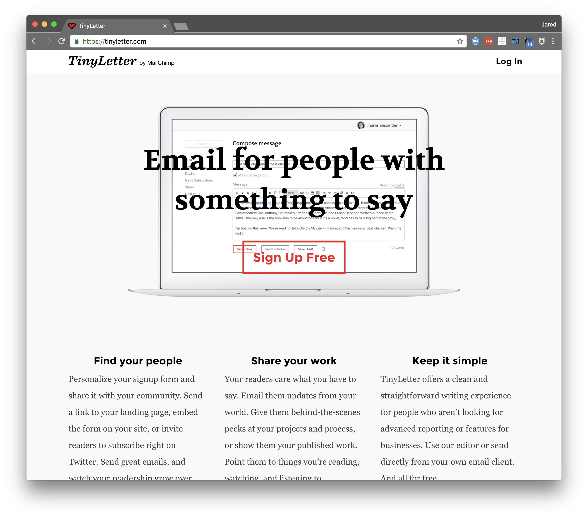

TinyLetter is a personal newsletter service created by the same people who make MailChimp.

> TinyLetter is for people who don't need all the business features that come along with MailChimp. Simplicity is at the heart of everything we do at TinyLetter.
>
> TinyLetter is a completely free service.[^1]

Unfortunately, the company plans to merge TinyLetter into their MailChimp offering.[^2] I still recommend it for the time being due to its sheer simplicity.

### Step 2: Configure your newsletter

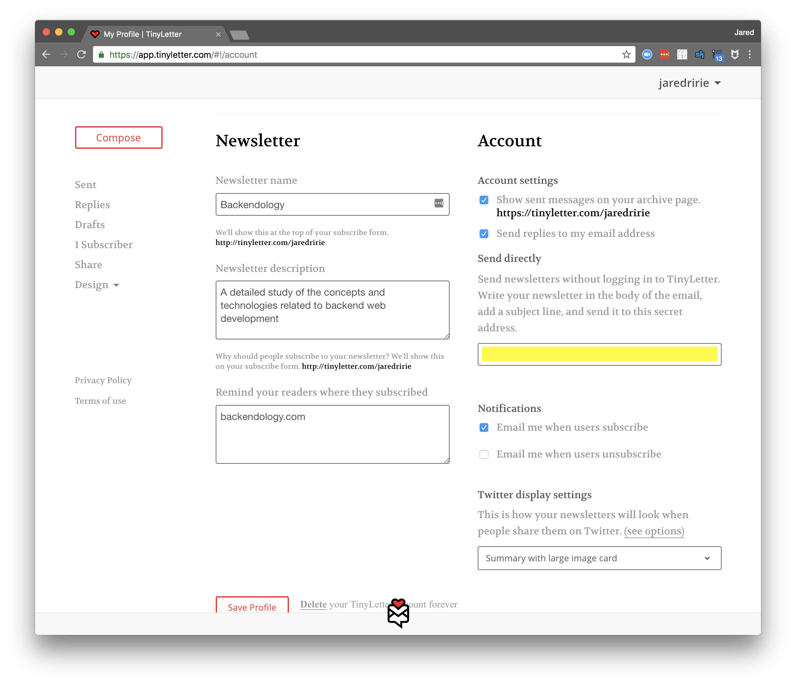

Configure your newsletter with a title and description. These will appear on a subscriber page your readers will use to enter their email addresses. [Here](https://tinyletter.com/jaredririe) is what mine looks like.

Make note of your secret TinyLetter email address (shown in yellow in the above image). This is the address to which you will send your newsletter. TinyLetter then stylizes your content and sends it on to your subscriber list.

## Zapier

Zapier is a service that allows you to set up integrations (called zaps) between other web services, email, RSS, apps, devices, etc. You configure a trigger and then a series of actions to run. An alternative is [IFTTT (if this, then that)](https://ifttt.com/).

It's worth noting that Zapier isn't required for a working newsletter. You could simply _manually_ send an email to the TinyLetter address above with the contents of each new blog. That said, I highly recommend a tool like Zapier as it automates this process for greater uniformity and efficiency.

We'll configure Zapier to check your blog's RSS feed every 5 minutes. When it detects a new post, it will automatically format and send an email to TinyLetter.

### Step 3: Set up a Zapier account

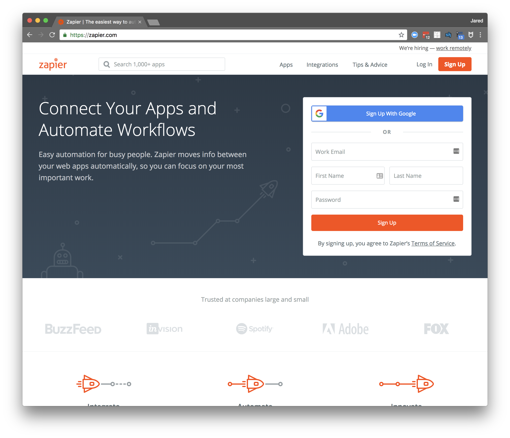

Sign up for a free Zapier account [here](https://zapier.com/apps/integrations).

### Step 4: Create a new Zap

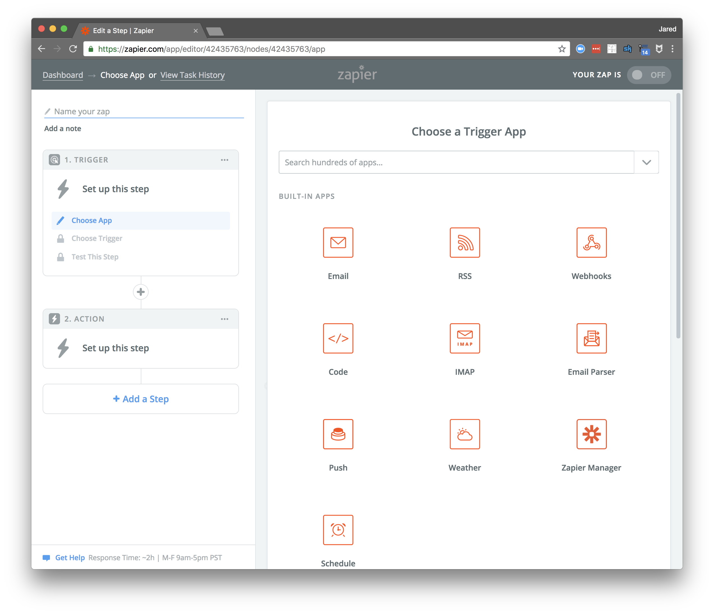

### Step 5: Configure the trigger to be an RSS feed

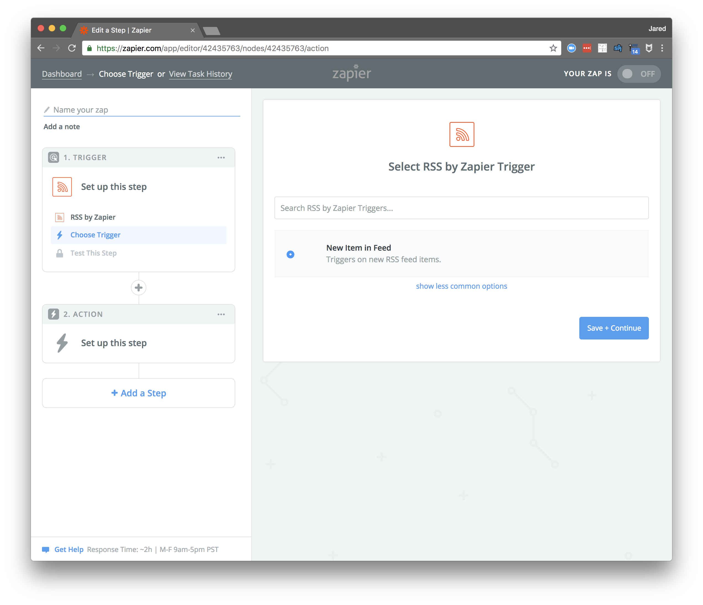

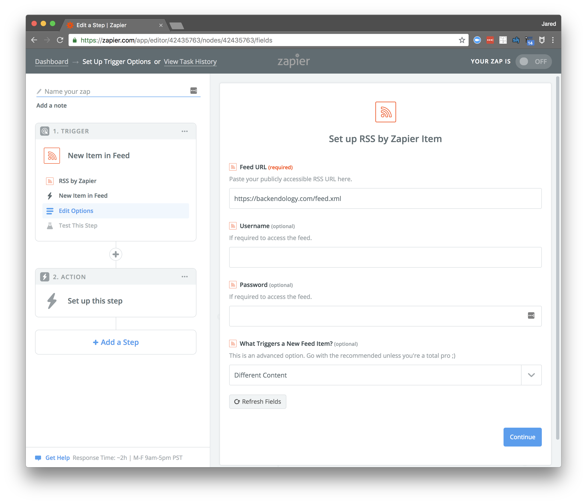

Your blog should have a publicly exposed RSS feed for this to work. [Here's mine](https://backendology.com/feed.xml) to see what it might look like.

### Step 6: Configure the action to be an outbound email

This zap will be quite simple and have a single action, to send an outbound email; the implication of this is that I'll send a newsletter about each new blog post. You may want your zap to be a bit more complicated. For example, let's assume that you write a few posts each month, but would only like to send an email once a month with a _digest_ of your posts. To get this working, your first action would be to "Append Entry and Schedule Digest" and your second action would send the outbound email.

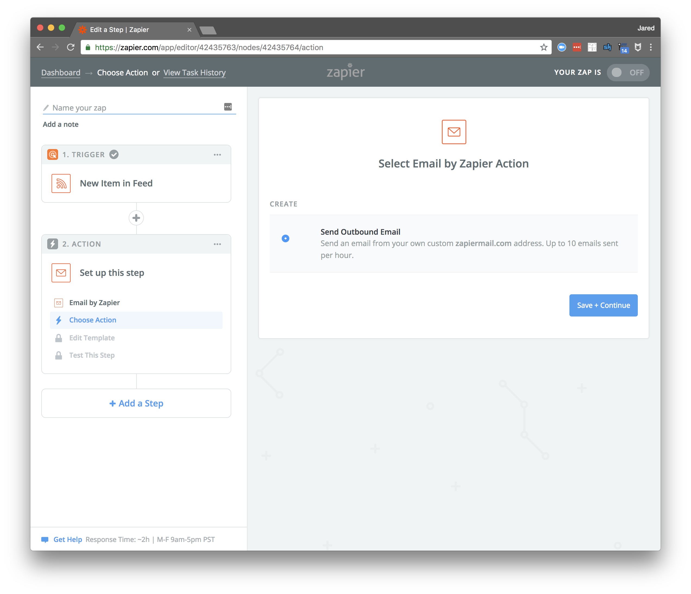

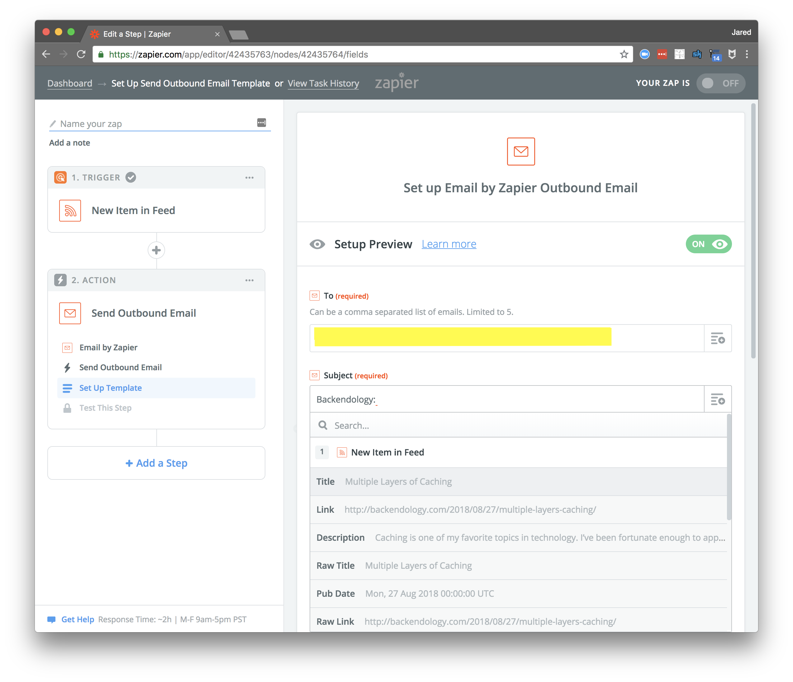

Remember your TinyLetter email address from step 2? This is where you'll use it. Put it in the "To" field. Then, chose what will go in the subject line. I chose to have the name of my blog (Backendology) followed by the title of the post. Zapier pulls this from the RSS feed.

### Step 7: Format your email based on the contents of the RSS feed

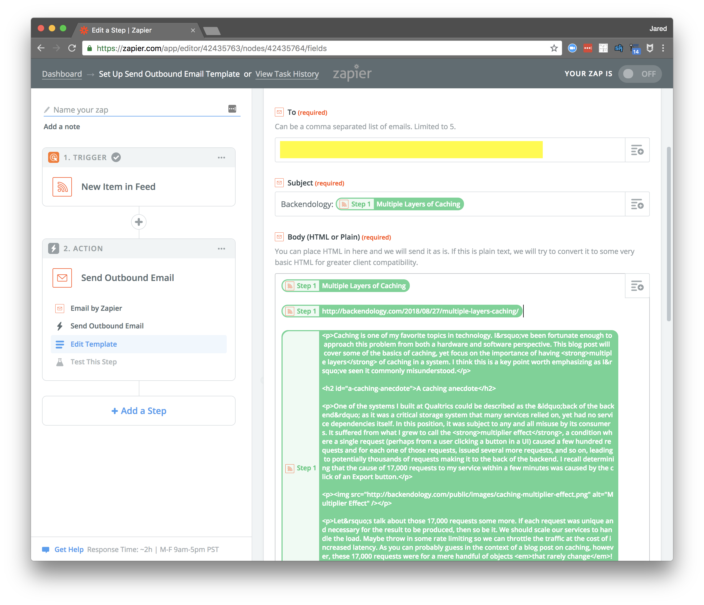

Format your email as you see fit. I have the title, the link, and the raw HTML content of my blog post. The HTML will render nicely in the email and give it a similar appearance to your actual blog post.

### Step 8: Enable your Zap

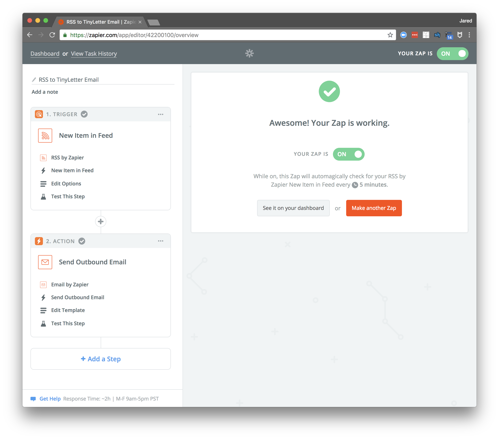

Zaps are disabled by default, so make sure to enable yours. Once enabled, it will automatically check your RSS feed every five minutes.

## Test it!

### Step 9: Send a test email and verify the result

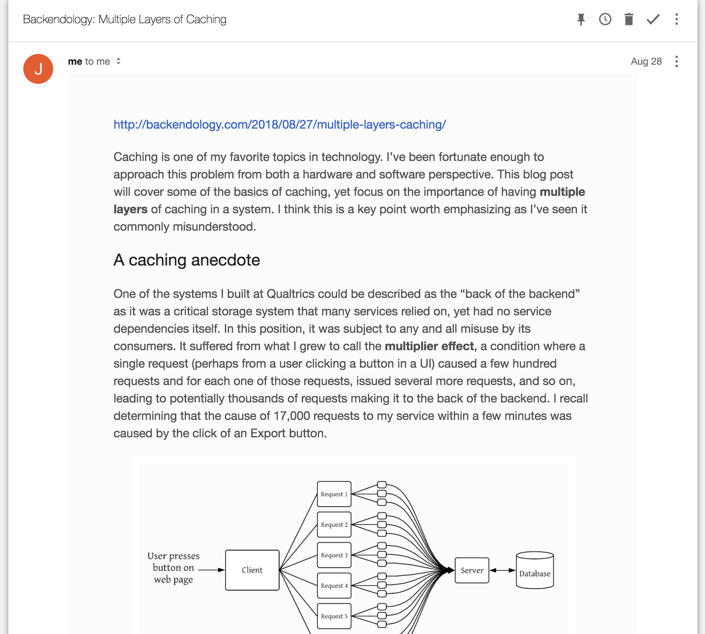

Zapier allows you to run a test of your zap. This is helpful as you can verify that it properly sends the email and then TinyLetter takes over and gets the email to all of your subscribers (likely just yourself at this point). Did the email come through as you hoped?

## Your Blog

### Step 10: Link to your TinyLetter subscriber page

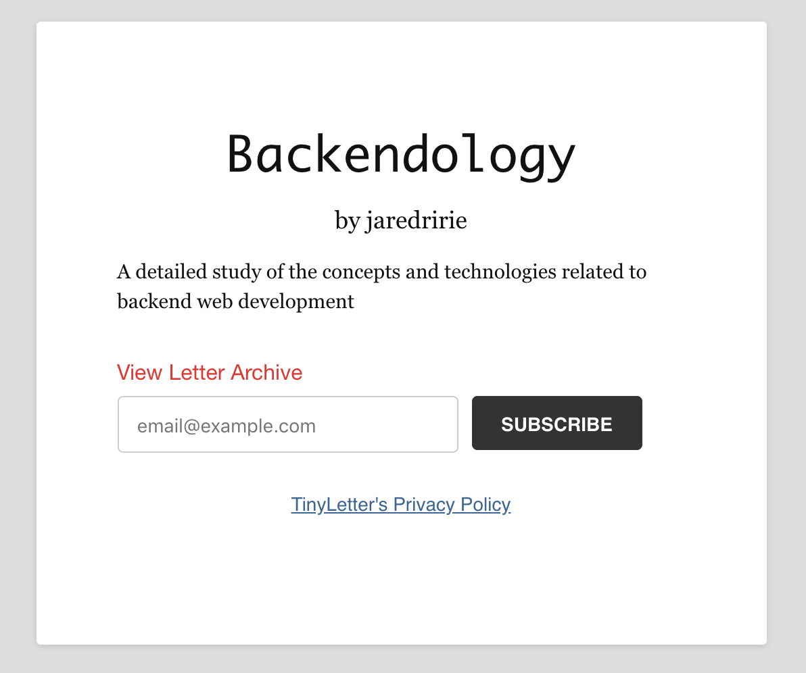

Finally, link to your subscriber page on your blog in a place your readers will find it! I created a new [fixed page on my blog](https://backendology.com/subscribe/) for this purpose and a link to that page on every post:

`layouts/post/single.html`
```html
<h3>Subscribe</h3>
<p><a href="/subscribe">Subscribe via my newsletter or RSS feed</a></p>
```

`layouts/fixed/subscribe.html`
```html
<div class="post">
  <h1 class="post-title">{{ .Title }}</h1>

  <p>Thank you for reading my blog!</p>

  <p>Sign up for my <a href="{{ .Site.Params.NewsletterSignup }}">email newsletter</a> or use this <a href="/feed.xml">RSS feed</a> to get notified of new blog posts.</p>
</div>
```

[^1]: https://www.tinyletter.com/site/about/
[^2]: http://uk.businessinsider.com/tinyletter-will-fold-into-mailchimp-in-the-future-but-its-not-going-to-happen-in-2018-2018-1?r=US&IR=T
